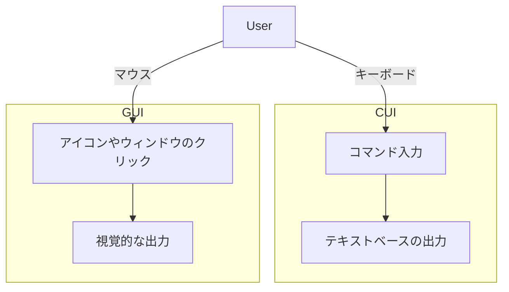

<br>

## CUIとは

**CUI (Character User Interface)** は、キーボードを使用してコマンドを入力することで操作するインターフェースです。UnixやLinuxのターミナル、Windowsのコマンドプロンプトが典型的な例です。ユーザーは特定のコマンドを覚える必要がありますが、シンプルでリソース消費が少ないのが特徴です。

```bash
$ ls -l
$ cd Documents
$ mkdir new_folder
```


## GUIとは

**GUI (Graphical User Interface)** は、マウスやタッチパネルを使用して、視覚的なアイコンやウィンドウを操作するインターフェースです。WindowsやmacOS、スマートフォンの操作がGUIの典型例です。直感的に操作できる一方、CUIよりもリソースを多く消費します。

## CUIとGUIの比較

以下はCUIとGUIの違いを示す図です：



この図では、CUIがキーボードを介してコマンドを入力し、テキストベースの出力を得ることに対して、GUIはマウスやタッチ操作を用いてアイコンやウィンドウをクリックし、視覚的なフィードバックを得ることを示しています。

## 結論
CUIは軽量で効率的ですが、コマンドを覚える必要があり、初心者には難しいと感じるかもしれません。一方、GUIは直感的で操作が簡単ですが、リソースを多く消費し、操作が遅くなることがあります。用途や操作環境に応じて、どちらを使用するか選択することが重要です。
