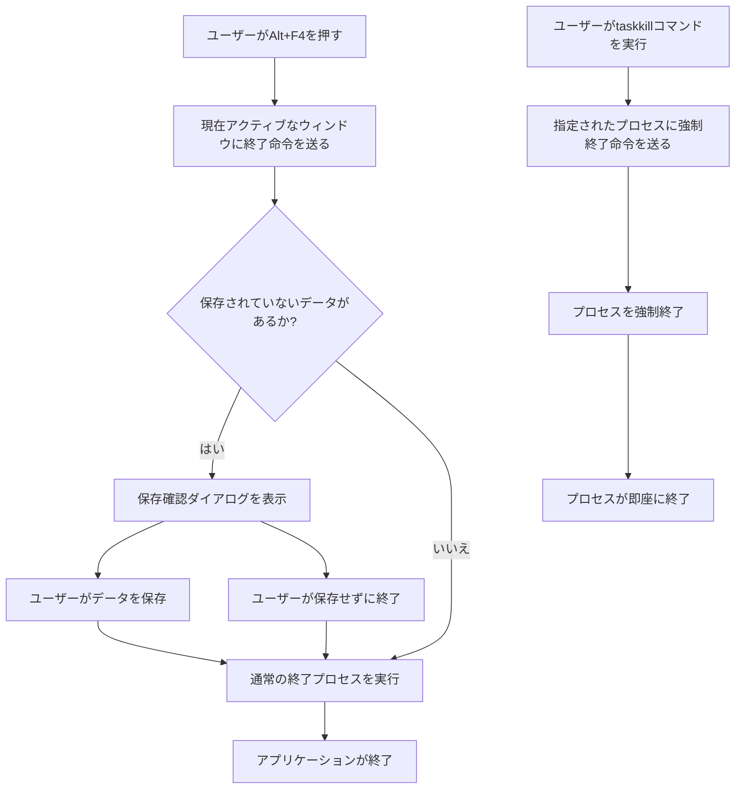

 
Windowsには、アプリケーションを終了させるためのさまざまな方法があります。代表的なものとして、キーボードショートカットの**Alt+F4**とコマンドラインツールの**taskkill**があります。これら二つの方法には、それぞれ異なる特徴と用途があります。

## Alt+F4の役割

**Alt+F4**は、現在アクティブなウィンドウやアプリケーションを閉じるためのキーボードショートカットです。

- **簡単な操作**: キーボードのAltキーを押しながらF4キーを押すだけでアプリケーションを閉じることができます。
- **通常の終了処理**: アプリケーションに通常の終了プロセスを実行させます。保存されていないデータがある場合、保存確認のダイアログが表示されます。
- **ユーザー向け**: ユーザーが直接操作するため、GUI操作の一環として利用されます。

## taskkillの役割

**taskkill**は、コマンドラインからプロセスを強制終了させるためのWindowsのコマンドです。

- **強制終了**: プロセスを即座に終了させることができます。保存されていないデータは失われる可能性があります。
- **スクリプトやバッチ処理向け**: コマンドラインから実行できるため、自動化されたスクリプトやバッチ処理で利用されることが多いです。
- **特定のプロセスを指定**: プロセスID（PID）やイメージ名を指定して特定のプロセスを終了させることができます。

## Alt+F4とtaskkillの違い

### 操作方法の違い

- **Alt+F4**: キーボードショートカットで簡単に操作できる。
- **taskkill**: コマンドラインでの入力が必要。

### 終了処理の違い

- **Alt+F4**: 通常の終了プロセスを実行するため、アプリケーションがデータを保存する時間を持てる。
- **taskkill**: 強制終了するため、アプリケーションにデータを保存する猶予を与えない。

### 利用シナリオの違い

- **Alt+F4**: 一般ユーザーが日常的にアプリケーションを閉じるときに使用。
- **taskkill**: システム管理者やパワーユーザーが特定のプロセスを強制終了する際や、スクリプトでの自動化に使用。

## Alt+F4とtaskkillの使い分け

> ### Alt+F4のメリット
> - 簡単に利用でき、通常の終了処理を行うため安全。
> - 保存されていないデータがある場合、保存確認ができる。
{: .prompt-info }

> ### Alt+F4のデメリット
> - 強制終了が必要な場合には適していない。
> - ウィンドウが応答しない場合には効果がないことがある。
{: .prompt-warning }

> ### taskkillのメリット
> - 応答しないプロセスやバックグラウンドプロセスを強制終了できる。
> - スクリプトやバッチ処理で利用可能。
{: .prompt-info }

> ### taskkillのデメリット
> - 強制終了のため、データが失われるリスクがある。
> - コマンドラインの知識が必要。
{: .prompt-warning }

## Alt+F4とtaskkillのフロー

